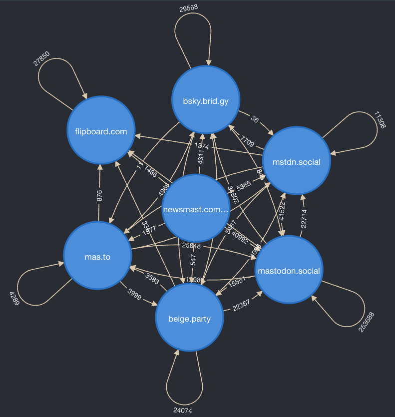

# Reblogs Mastodon Graph

## How to run this project:

If you want to run this project just follow the next steps. I assume you have Docker installed in your system.

1. Clone the repo: `git clone git@github.com:CarMoreno/TFM-reblogs-graph.git`
2. Go to the local folder: `cd /path/to/TFM-reblogs-graph`
3. Download the `authors.csv` and `rebloggers.csv` datasets from [Zenodo](https://zenodo.org/records/17781446).
4. Copy the above files `data` folder (folder is presented in this repo).
5. Start the local Neo4J database: `echo "NEO4J_PASSWORD=my_password" > .env && docker compose up`
6. Go to the graph-analysis jupyter notebook to create the `nodes.csv` and `relationships.csv` files, then you can create the graph into Neo4J using `create_nodes_db` and `create_relationships_db` functions.